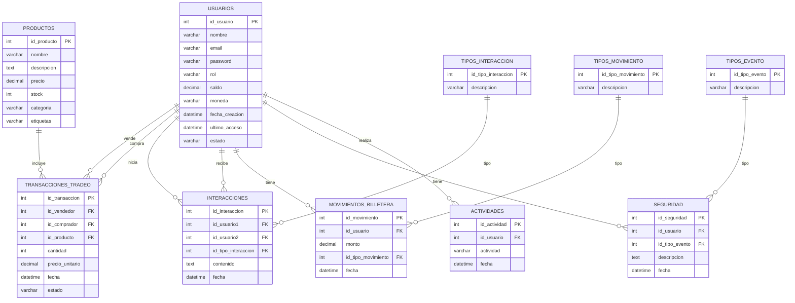

Resumen del diagrama:

    Usuarios
    Productos
    Transacciones_Tradeo
    Interacciones
    Tipos_Interaccion
    Movimientos_Billetera
    Tipos_Movimiento
    Seguridad
    Tipos_Evento
    Actividades

Relaciones entre las tablas:

    Transacciones_Tradeo: id_vendedor, id_comprador (Usuarios), id_producto (Productos)
    Interacciones: id_usuario1, id_usuario2 (Usuarios), id_tipo_interaccion (Tipos_Interaccion)
    Movimientos_Billetera: id_usuario (Usuarios), id_tipo_movimiento (Tipos_Movimiento)
    Seguridad: id_usuario (Usuarios), id_tipo_evento (Tipos_Evento)
    Actividades: id_usuario (Usuarios)

Tabla: Usuarios 

    id_usuario (int) - Identificador único del usuario.
    nombre (varchar(100)) - Nombre del usuario.
    email (varchar(100)) - Correo electrónico del usuario.
    contraseña (varchar(255)) - Contraseña del usuario.
    rol (varchar(50)) - Rol del usuario (e.g., administrador, cliente).
    saldo (decimal(10,2)) - Saldo disponible en la billetera del usuario.
    moneda (varchar(50)) - Tipo de moneda (e.g., USD, BTC).
    fecha_creacion (datetime) - Fecha de creación de la cuenta.
    ultimo_acceso (datetime) - Último acceso del usuario.
    estado (varchar(50)) - Estado de la cuenta (e.g., activa, suspendida).

Tabla: Productos

    id_producto (int) - Identificador único del producto.
    nombre (varchar(100)) - Nombre del producto.
    descripcion (text) - Descripción del producto.
    precio (decimal(10,2)) - Precio del producto.
    stock (int) - Cantidad en stock del producto.
    categoria (varchar(50)) - Categoría del producto.
    etiquetas (varchar(255)) - Etiquetas para búsqueda y filtrado.

Tabla: Transacciones_Tradeo

    id_transaccion (int) - Identificador único de la transacción.
    id_vendedor (int) - Identificador del usuario que vende.
    id_comprador (int) - Identificador del usuario que compra.
    id_producto (int) - Identificador del producto.
    cantidad (int) - Cantidad del producto en la transacción.
    precio_unitario (decimal(10,2)) - Precio unitario del producto.
    fecha (datetime) - Fecha y hora de la transacción.
    estado (varchar(50)) - Estado de la transacción (e.g., completada, pendiente).

Tabla: Interacciones

    id_interaccion (int) - Identificador único de la interacción.
    id_usuario1 (int) - Identificador del usuario que inicia la interacción.
    id_usuario2 (int) - Identificador del usuario que recibe la interacción.
    id_tipo_interaccion (int) - Identificador del tipo de interacción.
    contenido (text) - Contenido de la interacción.
    fecha (datetime) - Fecha y hora de la interacción.

Tabla: Tipos_Interaccion

    id_tipo_interaccion (int) - Identificador único del tipo de interacción.
    descripcion (varchar(50)) - Descripción del tipo de interacción (e.g., mensaje, comentario).

Tabla: Movimientos_Billetera

    id_movimiento (int) - Identificador único del movimiento.
    id_usuario (int) - Identificador del usuario.
    monto (decimal(10,2)) - Monto del movimiento.
    id_tipo_movimiento (int) - Identificador del tipo de movimiento.
    fecha (datetime) - Fecha y hora del movimiento.

Tabla: Tipos_Movimiento

    id_tipo_movimiento (int) - Identificador único del tipo de movimiento.
    descripcion (varchar(50)) - Descripción del tipo de movimiento (e.g., depósito, retiro).

Tabla: Seguridad

    id_seguridad (int) - Identificador único del registro de seguridad.
    id_usuario (int) - Identificador del usuario.
    id_tipo_evento (int) - Identificador del tipo de evento de seguridad.
    descripcion (text) - Descripción del evento.
    fecha (datetime) - Fecha y hora del evento.

Tabla: Tipos_Evento 

    id_tipo_evento (int) - Identificador único del tipo de evento de seguridad.
    descripcion (varchar(50)) - Descripción del tipo de evento (e.g., intento de login fallido).

Tabla: Actividades

    id_actividad (int) - Identificador único de la actividad.
    id_usuario (int) - Identificador del usuario.
    actividad (varchar(255)) - Descripción de la actividad (e.g., búsqueda realizada).
    fecha (datetime) - Fecha y hora de la actividad.

Relaciones entre las tablas:

    Usuarios:
        id_usuario es la clave primaria .

    Productos:
        id_producto es la clave primaria.
        categoria y etiquetas facilitan la búsqueda y el filtrado.

    Transacciones_Tradeo:
        id_transaccion es la clave primaria.
        id_vendedor y id_comprador son claves foráneas que se relacionan con id_usuario en la tabla Usuarios.
        id_producto es una clave foránea que se relaciona con id_producto en la tabla Productos.

    Interacciones:
        id_interaccion es la clave primaria.
        id_usuario1 y id_usuario2 son claves foráneas que se relacionan con id_usuario en la tabla Usuarios.
        id_tipo_interaccion es una clave foránea que se relaciona con id_tipo_interaccion en la tabla Tipos_Interaccion.

    Tipos_Interaccion:
        id_tipo_interaccion es la clave primaria.

    Movimientos_Billetera:
        id_movimiento es la clave primaria.
        id_usuario es una clave foránea que se relaciona con id_usuario en la tabla Usuarios.
        id_tipo_movimiento es una clave foránea que se relaciona con id_tipo_movimiento en la tabla Tipos_Movimiento.

    Tipos_Movimiento:
        id_tipo_movimiento es la clave primaria.

    Seguridad:
        id_seguridad es la clave primaria.
        id_usuario es una clave foránea que se relaciona con id_usuario en la tabla Usuarios.
        id_tipo_evento es una clave foránea que se relaciona con id_tipo_evento en la tabla Tipos_Evento.

    Tipos_Evento:
        id_tipo_evento es la clave primaria.

    Actividades:
        id_actividad es la clave primaria.
        id_usuario es una clave foránea que se relaciona con id_usuario en la tabla Usuarios.